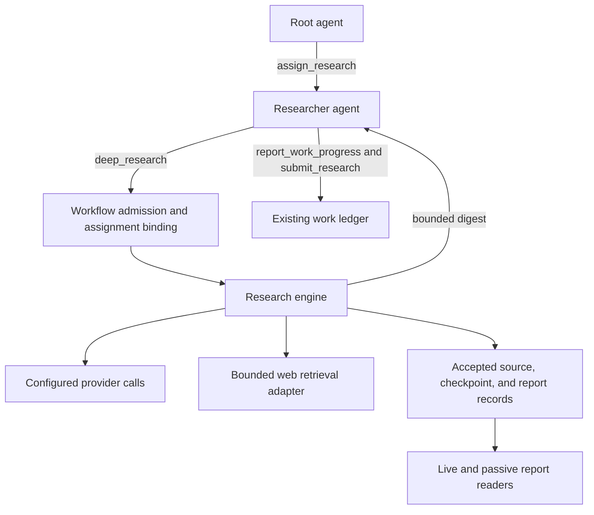

# Deep research implementation proposal

Status: approved proposal; experimental implementation added 2026-09-22.
See [implementation and validation](DEEP_RESEARCH_IMPLEMENTATION.md) for the
available behavior and outstanding quality evaluation. Original code review:
`f48eda5`. This proposal builds on
[DEEP_RESEARCH_DESIGN.md](DEEP_RESEARCH_DESIGN.md) and preserves that document as
the original research and deadline audit.

## Recommendation

Add an assignment-bound `deep_research` tool to the researcher role. A call runs
a bounded investigation: plan, search and read in adaptive rounds, reconcile
evidence, write a report, then verify its claims against retained source text.
The researcher submits its conclusions through the existing progress and brief
workflow. The root remains available throughout the investigation.

Implement the investigation as a small research engine with host-controlled
transitions and direct provider calls. Retain sources and report checkpoints in
the session's accepted log, expose bounded readers, and account for all internal
model and web operations. Ship behind an opt-in configuration flag after
deterministic lifecycle tests and a bounded quality evaluation.

The first release covers public HTML/text web research. Authenticated browsing,
remote PDF ingestion, local repository investigation, execution resumption after
a restart, and a general background-job service are later work. Existing
researchers can continue using their ordinary file, PDF, and diagnostic tools
outside `deep_research`.

## What the earlier research gets right—and what needs changing

| Finding | Proposal |
| --- | --- |
| A long tool call blocks its calling agent. | Keep the tool researcher-only. The root delegates through `assign_research`; no root-level start/poll API is needed. |
| The browser queue consumes the page-read timeout. | Fix this first. It remains present in [open_url.go](../../tool/open_url.go): `begin` starts the deadline before acquiring a slot. |
| Citations need a separate pass over source material. | Keep this, but verify source identity and passage locations deterministically before asking a model about support. |
| Bare provider calls versus child agents is unresolved. | Choose direct calls inside a bounded state machine; scouts are internal tasks, not registered agents. |
| The proposed argument struct uses `omitempty`. | Update it: [parameters.go](../../tool/parameters.go) now requires every declared field. Defaultable fields must be explicitly nullable. Also require at least one success criterion. |
| Full output belongs in `Captured`. | Keep the final report there, but also retain source/checkpoint records. `Captured` alone neither creates a report lookup service nor preserves intermediate work before tool completion. |
| Cancellation should retain useful work. | Keep that behavior; separate completion status from termination reason. The earlier text inconsistently used `partial`, `cancelled`, and `budget_exhausted` as statuses. |
| A progress sink supplies liveness information. | Add recorded milestones and operation deadlines. A counter supplies observations, not proof that a silent provider is hung. Do not restore the rejected stream watchdog. |

Two further code constraints shape the implementation:

- [Web snapshots](../../tool/web.go) default to a ten-minute TTL and a 16 MiB
  cache, with actor-bound cursors and space eviction. An investigation may last
  twenty minutes. Evidence must be copied into retained research records when
  read, rather than resolved from that cache at verification time.
- [Research briefs](../../work/research.go) are immutable and capped at 64 KiB.
  Findings are recorded separately, at most sixteen per
  [progress call](../../tool/progress.go). A large report cannot simply become a
  brief or be passed into `submit_research` as an array of draft findings.

The primary sources support adaptive orchestration and separate citation work.
Anthropic's account describes a lead researcher revisiting gaps before handing
documents and the report to a citation agent. Its token/performance correlation
comes from its own evaluation; it is not evidence that four scouts or a larger
budget will improve Strap's local models. That must be measured here.
[Anthropic engineering](https://www.anthropic.com/engineering/multi-agent-research-system).

## User and tool contract

The root clarifies important ambiguity before assigning a question, using the
existing researcher messaging and `wait_for_input` flow where useful. The
researcher supplies explicit acceptance criteria before starting the tool.
Sending an ordinary message while the call runs does not steer its internal
scouts; cancel/reassign the investigation to change its brief.

Proposed model-facing input, following the current required-field convention:

```json
{
  "work_id": "work-…",
  "question": "Which approach should we use, and why?",
  "context": null,
  "success_criteria": ["Compare the options and support the recommendation"],
  "must_cover": ["operational cost", "failure behavior"],
  "allow_domains": null,
  "block_domains": null,
  "depth": "standard",
  "max_minutes": null,
  "max_tokens": null
}
```

All fields must be present. `work_id`, nonblank `question`, and one to eight
nonblank criteria cannot be null. The other fields permit null, meaning no
constraint or the configured default.
Use the existing typed tool contract for schema generation and decoding. Limit
`must_cover` to twelve entries and each domain list to thirty-two. Bound the
question/context and total encoded input in host validation; the current schema
helper has no `MaxLength` constraint. Proposed total input cap: 32 KiB.

At admission, atomically validate the actor as the active research assignee and
capture `(work_id, assigned_at_revision, actor, invocation_id)`. Neither the actor
nor the assignment revision is model-supplied. This follows
[research diagnostics](../../internal/workflow/research_diagnostic.go). One run
per assignment may execute at a time; v1 admits one deep-research run per session
and returns an explicit busy result for another, without a hidden queue.

`depth` selects host-configured ceilings. `max_minutes` can only lower the time
ceiling; `max_tokens` adds a cap or lowers an existing host cap. Return the
resolved limits so defaults are visible. An
explicit token cap requires the accounting capabilities described below; reject
it before starting if the selected provider cannot enforce it.

### Returned report

Use a distinct `research-…` report identifier; `report-…` already identifies a
work-progress report. Each immutable report includes:

| Field | Meaning |
| --- | --- |
| Identity | Report ID, schema version, work/assignment/actor/invocation binding, timestamps, model and prompt versions. |
| Outcome | `status: complete / partial / failed`; separate `stop_reason: completed / insufficient_evidence / deadline / token_budget / request_budget / retention_budget / output_limit / cancelled / reassigned / provider_error / invalid_model_output`. |
| Conclusions | Summary, findings, disagreements, open questions, limitations, recommendation, proposed steps. |
| Evidence | Source manifest and claim-to-passage links; each finding has the existing `basis`, `evidence`, and `limitation` vocabulary plus a verification verdict. |
| Coverage | Every success criterion and required topic, supporting finding IDs, and `met / partial / unmet` with reasons. |
| Accounting | Resolved limits, elapsed time, searches/fetches/model calls and attempts, reported token counts, missing-usage counts, reserved token charges. |
| Presentation | Digest truncation and continuation cursor, distinct from source text discarded during acquisition. |

`complete` requires all acceptance criteria and required topics to be met and all
material factual statements in the report to have passed verification. An
unresolved disagreement can still be a complete finding when the question is
answered by explaining it. Recommendations and inferences must identify their
premises and limitations; they are not reported as verified facts.

An admitted run that stops early returns `partial` if it retained useful
evidence, otherwise `failed`, with the specific reason. Ordinary source failures
are recorded limitations. Invalid arguments, authorization failures, and failure
to retain required records remain tool errors. In particular, “always return
something” must not turn storage failure into an apparently trustworthy report.

## Engine and package boundaries

Introduce a `research` package for report/source types, budgets, the state
machine, and narrow model/retrieval/recording interfaces. It must not import
`agent`, `conversation`, `tool`, or `harness`. The `tool` package declares the
typed tool adapter; workflow supplies its authorized handler. Harness constructs
the engine, providers, retrieval adapter, and recording/read services.



Scouts use small, isolated contexts and propose the next search/read/extraction
step. The host validates and executes only those supported actions. Planning,
reconciliation, synthesis, and verification each return one schema-validated
stage result. Permit one repair call for malformed output, charged to the shared
budget. Reject unknown actions, source IDs, and out-of-range evidence spans.
Do not execute arbitrary tool calls emitted by these providers.

This is a deliberately narrow model-driven search loop, not a second general
agent runtime. It has no inbox, work assignment, shell, file writes, nested
delegation, or messaging. Direct calls avoid child-agent lifecycle and tool
capability overhead, but they also bypass `agent.Agent`'s usage, reasoning limits,
and recording. The engine must explicitly bound streamed output and reasoning,
record usage on error as well as success, and honor `provider.Submit`'s rule that
failed response content is unusable. Transport parsing stays in `provider`.

| Stage | Behavior and exit condition |
| --- | --- |
| Plan | Map criteria to at most eight subquestions, with dependencies and initial queries. Schedule only independent questions together. |
| Scout | Search, triage, read relevant passages, and extract candidate claims. Return structured findings plus `complete / partial / failed` and reasons. Search snippets are leads, not final evidence. |
| Reconcile | Merge duplicates, inspect source independence and conflicting dates/definitions, update coverage, and request targeted follow-up. |
| Repeat | Allow at most two follow-up rounds in standard mode. Stop when coverage is sufficient, a round adds no useful evidence, or a budget/reserve is reached. |
| Synthesize | Write sections against the evidence/claim inventory, preserving disagreements. Require claim IDs for material statements, including summary and recommendation premises. |
| Verify | Use a fresh context containing draft claims and original retained passages, with enough surrounding text to judge support. No scout reasoning or confidence scores. |
| Finalize | Remove unsupported statements, label justified inferences, compute coverage and accounting, retain the report, and return a digest. |

A verifier returns `supported / contradicted / insufficient` with source spans
and a short reason. A separate pass is not an independent truth oracle when it
uses the same model. Preserve the verdict and measure its error rate. A false or
unsupported factual claim must not be laundered into the report by merely
changing its basis to `inferred`. Any model rewrite after verification must be
verified again; v1 favors deterministic removal and templated qualification.

## Evidence, retention, and readers

Assign source IDs in the host. A source record contains requested/final URLs,
title, fetch time, content type, content hash, exact retained text chunks and
their offsets, and document/selection truncation flags. Define offsets as UTF-8
byte ranges at rune boundaries and hash the exact retained bytes. Record publication dates
only when actually obtained. A claim cites a source ID and a span in its retained
text; matching the span is deterministic, semantic support is model-judged.
Never cite a URL merely because it appeared in search results.

Use conservative URL normalization and content hashes to deduplicate within a
run. Different fetches with changed content remain different snapshots. Preserve
query parameters with possible semantic meaning. Copied articles do not count as
independent corroboration; provenance and disagreement are explicit findings.

Persist accepted sources before referencing them in checkpoints. Use the
existing session log and its [content framing](../../harness/eventcodec/publish.go),
with new versioned research records and projections. The final report goes in
`tool.Result.Captured`; `Content` contains a digest capped at 12 KiB, the report
ID, outcome, coverage gaps, and reader instructions. Source bodies stay in their
own records rather than being duplicated into the digest or final report.

Provide `get_research_report` modes for the report, sources, an individual source,
and continuation, plus equivalent live Go/HTTP and passive inspection readers.
Follow [progress readers](../../harness/inspection/progress.go): bounded pages,
signed cursors pinned to an accepted record prefix, and current work visibility
checked on every live continuation. Root and currently authorized workers may
read; possession of a report ID or cursor grants no access. Archive access follows
the existing trusted archive-reader boundary.

The researcher forwards selected verified findings to `report_work_progress` in
batches, retaining original URLs, snapshot hashes, and source-span locators in
the existing evidence fields. Deep-report finding IDs are local references,
not ledger-issued `finding_id`s; use the progress receipts for `submit_research`.
The engine does not mutate findings or mark work delivered automatically.
Include the research report ID in the bounded brief summary initially; a typed
brief attachment relation can follow if consumers need it.

There is no second durable database or TTL-based report registry. Indexes are
derived from accepted records and can be rebuilt. Retention lasts through the
session's existing storage lifetime; recording and reopening an archive restore
inspection, not executing scouts. A log ending before finalization displays an
incomplete run and its last accepted checkpoint. Do not infer successful finish.

## Budgets and resource ownership

Start with the following experimental presets, then tune using the evaluation.
These are ceilings, not target spend or quality promises.

| Limit | Survey | Standard | Exhaustive |
| --- | ---: | ---: | ---: |
| Default wall time | 2 min | 6 min | 15 min |
| Maximum simultaneous scouts | 1 | 2 | 4 |
| Subquestions | 3 | 6 | 8 |
| Search attempts | 8 | 20 | 40 |
| Fresh fetch attempts | 12 | 30 | 60 |
| Model calls, including repairs/retries | 16 | 40 | 80 |
| Follow-up rounds | 1 | 2 | 3 |

The host can change presets, with an absolute default maximum duration of twenty
minutes. `max_minutes` may shorten the selected preset; increasing beyond it
requires host configuration. Enforce shared counters atomically before work
starts so concurrent scouts cannot each spend the full allowance. Record both
attempts and successes. Cache continuation consumes read/context capacity but
not another fresh-fetch allowance. Permit at most one retry per transient
operation; permanent errors do not retry. All attempts consume limits.

Reserve the last 25% of time and model-call capacity for reconciliation,
synthesis, verification, and finalization; apply the same division to an enabled
token budget. Acquisition calls inherit the acquisition deadline. At the hard
deadline, finalize deterministically from accepted state without another model
call. The result may be partial. Interruption cancels immediately rather than
spending the reserve. Resource cleanup has its own short bounded allowance,
reported separately from research time.

Token enforcement can use capabilities already present in
[provider](../../provider/tokens.go): count the exact input, obtain the configured
[output cap](../../provider/limits.go), and atomically reserve input plus maximum
output before each submission. Settle against returned usage; if usage is
missing or a call fails without counts, keep the conservative reservation
charged. Counting itself must be deadline-bound and admission-limited. Reject
impossible reservations before generation. Enforcement relies on the provider
honoring its advertised counting/output-cap contracts.

`max_tokens: null` uses a host cap when configured. Without both capabilities,
allow time/request-bounded research only when no token cap is requested, and
report accounting as incomplete when usage is absent. Never call missing usage
zero or advertise a strict financial cap. vLLM exposes both capabilities when an
output limit is configured; the current Chat Completions adapter does not. Do
not change every provider API just to ship v1. Configure a research-specific
output cap when needed: an inherited 128K output cap can make even a small request
inadmissible under a smaller total token allowance. Do not silently shrink an
immutable shared provider's settings.

Bound memory separately: proposed defaults are 256 KiB of report JSON, 512 KiB
retained text per source, 16 MiB source text per run, and 64 MiB of retained
research artifacts per session. Size the remaining metadata/call records too;
reserve final-report space before acquisition. Bound each model request's input
and streamed output bytes, and select source passages rather than concatenating
the corpus. If a report exceeds its cap, use an explicit partial-report form
with omitted counts and evidence references; never truncate serialized JSON.
Stop admission/acquisition when a quota is reached; do not evict cited sources.
These limits bound the new feature, not all pre-existing session memory.

Configure a dedicated research provider or inherit the researcher's model
settings. Harness owns created transports/resources and closes them after
joining runs; injected dependencies retain their existing ownership rules. A
separate client pointing at the same saturated server does not isolate compute:
limit research model concurrency and keep a host override for single-slot local
servers. Root inbox responsiveness and root model latency are different things.

### Web prerequisites

Add `OpenQueueTimeout` and configurable `OpenConcurrency` to `WebConfig`.
Retain a default concurrency of two; research can explicitly opt into four after
measurement. Preserve a parent/session cancellation context across queueing and
reading. Start `OpenTimeout` only after acquiring the slot, with a separate queue
timer and distinguishable queue/read failures. Do not derive the read context
from an expired queue context. Every admitted path must release slots and close
owned browser sessions, including cancellation while waiting and shutdown.

Use one session-owned web runtime and aggregate semaphore initially; creating a
second runtime would silently multiply browser capacity. Add a typed retrieval
adapter so the engine can retain exactly the page chunks it read without putting
large source text into the outer researcher's history.

Domain filters apply to source eligibility: normalize hostnames, match exact
hosts or dot-boundary subdomains, and let block rules win. Check initial URLs
before opening and final URLs before accepting evidence; search results are
filtered in the host even if the backend supports domain hints. Reject credentials
and non-HTTP(S) URLs using existing validation. The current rendered browser
cannot enforce a network-level domain sandbox: redirects and subresources may
contact other hosts. Do not market these filters as an egress control. Treat all
retrieved text as untrusted data, never as permission to change the brief, invoke
tools, or expose context in search queries.

## Progress, cancellation, and failure semantics

Use an injected research recorder for required lifecycle, source, checkpoint,
and per-call accounting records. This fits the current typed reporter/log design;
the earlier proposed `OnToolProgress` hook is not an existing API. A generic
`tool.Call.Progress` facility can wait until another long-running tool needs it.

Progress includes stage, round/scout ID, monotonic completed-step count,
search/fetch/model counters, active operation and start time, last useful
milestone, and the applicable deadline. Persist stage transitions and meaningful
completed work. UI updates may be coalesced; required evidence/terminal records
may not be silently dropped. Publish outside runtime locks; observer slowness
must not block a run, while required storage backpressure/failure follows the
existing log contract. Storage failure cancels the run and remains an error.

The host can show “reading source 7” or “waiting for model, 45 seconds” without
inserting updates into model history or waking the root for every page. Keep
root notifications for completion or actionable failure, using existing work
notification behavior for the researcher's eventual submission.

Operation and overall deadlines bound execution; a changing progress count does
not extend either. No progress during a provider call means the operation is
pending, not proven dead. A general semantic-hang detector stays outside this
proposal, consistent with [rejected ADR-004](ADR-004-stream-liveness.md).

Session interrupt/close cancels and joins all scouts, fetches, and provider
calls. Retain accepted evidence and finish with a partial/cancelled outcome under
the original binding, using bounded cancellation-independent storage settlement,
not a new generation. Follow [ADR-003](ADR-003-session-interruption.md): interrupted
work is not submitted and ordinary conversation can continue afterward.

Work cancellation and reassignment need an additional explicit hook. Today,
`CancelWork` changes the ledger; it does not directly cancel a long tool call.
Register the run's cancellation handle under its captured assignment binding,
coordinate registration with cancel/reassign to avoid a lost-cancellation race,
and cancel it when that binding retires. Revalidate before admitting each new
external operation. Late results may be retained as evidence of the old run,
but cannot be published as progress or delivery for a newer assignment. The
small active-run handle map is lifecycle bookkeeping, not a background-job API.

All collaborators must honor cancellation. Go cannot force an arbitrary
provider goroutine to exit; a dependency that ignores cancellation must surface
failed settlement rather than let the host falsely report a clean stop.

## Implementation checkpoints and acceptance

Each row is a separate reviewable change with deterministic tests. Do not enable
the tool until the lifecycle and retention path is complete.

| Checkpoint | Main code area | Acceptance gate |
| --- | --- | --- |
| 1. Contracts and evaluation fixtures | New `research` types, `tool/deep_research.go`, focused `eval` fixtures | Required/null input behavior; nonempty criteria; bounded report fixtures; unsupported claim and missing-source examples have known expected outcomes. |
| 2. Web scheduling | `tool/web.go`, `tool/open_url.go`, web tests | With more callers than slots, each admitted read gets its own read budget; queue cancellation, read cancellation, close, and slot release pass under the race detector. |
| 3. Retained research records/readers | `harness/record`, `eventcodec`, `projection`, `inspection`, HTTP | Replay reconstructs sources and partial/final reports; expired web cache has no effect; bounded cursors, authorization changes, source spans, quotas, and failed capture are tested. Version the event schema and preserve old-archive reads. |
| 4. Serial engine | New `research` engine and harness retrieval/provider adapters | Scripted providers demonstrate gap-driven follow-up, bounded malformed-output repair, deduplication, contradiction handling, and shared budgets; all internal usage is visible. |
| 5. Verification and safe finalization | `research` verifier and report builder | Fabricated sources/spans rejected; unsupported summary claims removed; changed post-verification claims rechecked; exhausted reserve/cancelled runs retain honest partial output. |
| 6. Bounded parallel scouts | `research` scheduling | One failing scout does not discard others; simultaneous reservations cannot overspend; deterministic report ordering; cancellation joins all children; source/request byte bounds hold. |
| 7. Workflow and host integration | `internal/workflow`, `harness/session.go`, prompts, CLI/TUI | Researcher-only registration; correct work binding; root accepts input during a run; cancel/reassign registration races, interrupt, close, and continuation tested; brief remains below its cap. |
| 8. Bounded live evaluation and opt-in release | `eval`, configuration, documentation | Quality/cost comparison below is recorded; scripted tests remain network-free; effective configuration shows resolved feature/model/resource limits. |

Run targeted package tests for each checkpoint, race tests for concurrency and
shutdown changes, and the repository's standard full checks before release.
Include a fake model that stays quiet until cancellation: it must be shown as a
pending operation and then canceled by its operation/run deadline, without a
resurrected stream-idle watchdog.

### Quality gate

Separate report quality from citation reliability, following the distinction in
[DeepResearch Bench](https://arxiv.org/abs/2506.11763) and its
[reference implementation](https://github.com/Ayanami0730/deep_research_bench).
Use focused research fixtures alongside the existing eval infrastructure rather
than assuming the coding ladder can score long reports unchanged.

Start with twelve fixed questions covering comparison, dated factual lookup,
conflicting sources, a constrained-domain investigation, sparse evidence, and
multi-hop questions. Include source text with prompt injection and plausible
but incorrect citations. Preserve the exact source corpus and report artifacts.

Measure citation validity (retained source/span exists), faithfulness (the source
supports the claim), groundedness (material factual claims with supporting
evidence / all such claims), coverage, useful conclusions, latency, and usage.
Missing or contradicted claims count against the denominator; refusing every
claim must not produce a winning score. Have a human label a small claim set to
calibrate any model judge independently of the production verifier.

Compare the existing researcher, the serial engine, and the two-scout engine at
matched model and resource budgets, including a verifier-on/off ablation. Use
frozen sources for repeatability and a small separate live-web smoke set. Run
three repetitions per condition and report ranges and failures, not just means.

Proposed pilot thresholds: 100% resolvable citations, at least 95% human-checked
faithfulness and groundedness, and at least 90% required coverage on the
answerable fixture subset. Correctly identifying insufficient evidence is the
expected result on the sparse subset. These are acceptance targets to validate,
not current results. Parallel mode ships only if it earns its additional cost;
otherwise keep standard mode serial. Broad enablement waits for all lifecycle
gates and this recorded evaluation.

## Decisions to carry into implementation

| Choice | Reason and trade-off |
| --- | --- |
| Researcher-bound synchronous call | Reuses existing delegation and cancellation ownership; the researcher itself cannot consume new messages during the call. |
| Direct provider stages with bounded adaptive scouts | Keeps capability and budget control explicit; requires its own limited accounting, validation, and observation path. Full agents become worthwhile only if scouts later need general tool/inbox behavior. |
| Accepted-log evidence and read projections | Fits existing recovery and authorization; adds schemas and retention volume, but avoids an unrelated job/artifact store. |
| Fresh verification context | Reduces reliance on scout summaries; costs tokens and remains fallible, so it needs an ablation and independent grading. |
| Optional hard token budget with capability checks | Uses existing provider interfaces honestly; not all configured providers can offer the same guarantee. |
| Observable bounded execution before a general liveness solution | Makes this feature testable without reviving a rejected watchdog; does not promise early detection of every hung collaborator. |

The proposed default is a six-minute standard investigation with two scouts,
public-web acquisition, and independent verification context. The quality gate
may reduce scout concurrency to one. Begin with contracts/fixtures and the web
queue fix; the retained evidence and cancellation slices are prerequisites for
an end-to-end prototype worth evaluating.
