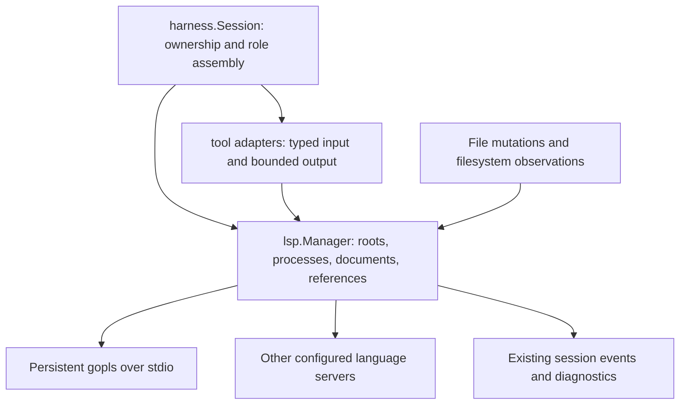

# Language server support for Strap

Status: implemented as an experimental read-only integration, September 20, 2026.
This document preserves the research and design rationale. See [the shipped API
and current limits](../lsp.md) for operational behavior and verification status.
Working scope: Go first, using `gopls`; navigation and diagnostics before semantic
edits. Additional servers should use the same tools and runtime contract.

The [implementation plan](LSP_IMPLEMENTATION_PLAN.md) defines the extension
interface, package layout, ordered milestones, and release checks.

Add a session-owned language server client with a small, task-oriented tool
surface. Let agents discover symbols, inspect their source and types, follow
relationships, and check diagnostics. Keep protocol messages, document versions,
server processes, and synchronization inside the client. Preserve shell search
for literal text, configuration, comments, and unsupported languages.

This is the recommended fit for Strap's current architecture, not a demonstrated
optimum across models. Qualify the tool shapes with Strap's actual models before
making them defaults.

**What the research establishes**

| Approach | Observed design | Implication for Strap |
| --- | --- | --- |
| [OpenCode](https://opencode.ai/docs/tools/#lsp-experimental) | An experimental `lsp` tool groups definitions, references, hover, symbols, implementations, and call hierarchy. Its [implementation](https://github.com/anomalyco/opencode/blob/dev/packages/opencode/src/tool/lsp.ts) accepts an operation, file, line, and character, even for operations with different argument needs. | Useful coverage baseline. One tool name is compact, but the model still needs to understand several input contracts. |
| [Serena](https://oraios.github.io/serena/01-about/035_tools.html) | Offers symbol search, file outlines, referencing symbols, diagnostics, and symbol edits through higher-level tools; also offers a programmable interface. | Symbol discovery and reusable results are useful ideas. A new programmable tool runtime is unnecessary for Strap's first integration. |
| [Claude Code](https://code.claude.com/docs/en/discover-plugins#code-intelligence) | Combines navigation with diagnostics after edits. Language plugins configure servers; users install the binaries separately. | Diagnostics should participate in the editing loop, and server configuration should be separate from model tool arguments. |
| [LSP](https://microsoft.github.io/language-server-protocol/specifications/lsp/3.17/specification/) | Defines capability-negotiated requests, notifications, and server callbacks. | A persistent client needs lifecycle and synchronization support; wrapping isolated JSON-RPC calls is insufficient. |

A [preliminary study](https://arxiv.org/abs/2608.13568) reports that the value of
semantic retrieval depends on task and model, and does not establish universal
token savings. Its abstract was reviewed, not its experiments reproduced. Treat
it as a reason to evaluate correctness, recall, and tokens-to-success together.

**Fit with the existing code**

- [harness/session.go](../../harness/session.go) constructs shared tools and owns
  resources. [harness/lifecycle.go](../../harness/lifecycle.go) joins execution
  before closing resources. The LSP manager belongs to this lifetime.
- [tool/tool.go](../../tool/tool.go) requires cancellation and concurrent-call
  safety. `tool.JSON` already carries structured results into model history;
  `Result.Captured` can retain bounded additional host evidence.
- [tool/files.go](../../tool/files.go) serializes direct file operations but
  explicitly excludes shell commands and external editors from its lock.
  Semantic queries cannot assume all changes pass through `edit_file`.
- [The input contract](../tool-input-contract.md) requires a closed `input`
  object, all fields present, and explicit null for nullable values. Use its
  current rules; historical examples in older design reviews can predate them.
- [The schema review](MODEL_TOOL_SCHEMA_REVIEW.md) records problems with mixed
  operation forms. Prefer separate tools where argument shapes differ, while
  allowing small enums for operations whose inputs really are identical.
- The current role assembly removes `write_file` and `edit_file` by name.
  Future semantic mutation tools need explicit role registration; they must not
  accidentally pass through this filter. Researchers and auditors can use the
  semantic read tools. Shell access remains governed by its existing policy.

**Architecture alternatives**

| Option | Assessment |
| --- | --- |
| Native Go client behind typed tools | Recommended: fits session ownership, strict schemas, shared agent state, and existing recording. Costs ongoing protocol and server-compatibility work. |
| External semantic toolkit, such as Serena | Useful evaluation baseline and possible future adapter. Strap currently has no MCP client in the inspected Go code; integration would add a transport/runtime and still need decisions about schemas, ownership, and file-change visibility. |
| Language-specific CLI calls | Useful for a feasibility spike. A production interface would need per-language wrappers and an explicit strategy for preserving server state. |
| Generic `lsp_request(method, params)` | Flexible for a developer debugging protocol traffic, but moves URI encoding, capabilities, protocol unions, and lifecycle knowledge into the model contract. Keep it out of the agent toolset. |

**Recommended model tools**

Use seven tools initially. Names are proposed. `target` below means one of the
two complete argument forms described afterward, not an untyped JSON object.
Every nullable field remains present in actual calls.

| Tool | Input beyond the `input` envelope | Result and intended use |
| --- | --- | --- |
| `lsp_status` | `path: string or null` | Configured servers, selected roots, process state, supported operations, and actionable setup/load failures. Null lists the session. Inspection does not launch every server. |
| `lsp_symbols` | `query`, `path: string or null`, `limit: int or null`, `cursor: string or null` | Workspace symbol candidates with name, kind, container, location, reference, and a short source excerpt. Null path searches configured session roots; a path restricts routing and results. Require a nonempty query. |
| `lsp_outline` | `path`, `depth: int or null`, `limit: int or null`, `cursor: string or null` | File declarations and their parent relationships, selection ranges, and available full ranges. Default depth 1 lists top-level declarations. |
| `lsp_inspect` | `target`, `include_source: bool or null` | Hover/type documentation and a bounded source excerpt. Null includes source. Include the declaration body only when a trustworthy full range is available. |
| `lsp_navigate` | `target`, `relation`, `limit: int or null`, `cursor: string or null` | Locations for `definition`, `declaration`, `type_definition`, or `implementation`. These share the same inputs; a small relation enum is appropriate. |
| `lsp_references` | `target`, `include_declaration: bool or null`, `limit: int or null`, `cursor: string or null` | Usages with location references and small source excerpts. Null excludes the declaration. Avoid automatically expanding every enclosing function. |
| `lsp_diagnostics` | `paths: string[] or null`, `limit: int or null`, `cursor: string or null` | Errors and warnings with source, code, range, freshness, and coverage. A nonempty paths list checks those files. Null reads the currently known session diagnostic view; it does not promise a whole-project check. Reject an empty paths list. |

Start with a 50-item default page, a 200-item maximum, and a 16 KiB model-output
budget per call, independently of the item limit. These are proposed tuning
values, not protocol limits. Default inspection source to at most 80 lines within
the same byte budget. Do not fetch hover text for every workspace search hit.

Add `lsp_calls(target, direction, limit, cursor)` after the first slice, with
`direction: incoming | outgoing`. Hide `prepareCallHierarchy` and preserve its
server data internally; multiple prepared candidates must be returned for
selection rather than picking one arbitrarily. Calls are a distinct relationship
from references. The [call hierarchy protocol](https://github.com/microsoft/language-server-protocol/blob/gh-pages/_specifications/lsp/3.17/language/callHierarchy.md)
uses a two-step exchange and opaque item data.

Defer completion, semantic tokens, inlay hints, code lenses, formatting, type
hierarchies, recursive call-graph expansion, and arbitrary server commands until
tasks justify them. Keep server installation/restart/configuration in host
controls, rather than requiring agents to administer processes.

**Addressing code without making the model manage LSP**

Search, outline, navigation, and reference results return a short opaque `ref`
alongside a human-readable location. A reference identifies a location in an
observed document snapshot, not an eternal symbol identity. Use selection ranges
for navigation and separately retain full declaration ranges for source reads.
References to usages must retain the usage location so hover and definition
queries still answer the question at that occurrence.

Allow exactly two target forms, composed as complete typed branches using
`tool.ComposeBy("target_kind", ...)`:

```json
{
  "input": {
    "target_kind": "reference",
    "ref": "loc_42",
    "include_declaration": false,
    "limit": 50,
    "cursor": null
  }
}
```

This is a call to `lsp_references`. Its source-identifier alternative is:

```json
{
  "input": {
    "target_kind": "symbol",
    "path": "example.go",
    "line": 12,
    "symbol": "Serve",
    "context": null,
    "include_declaration": false,
    "limit": 50,
    "cursor": null
  }
}
```

The second example is illustrative, not a location in this repository. Live
Qwen3.6 workflows repeatedly miscounted initial columns even after reading the
correct file. The September 20 reliability follow-up therefore replaces the
model-facing position branch with an exact identifier on an observed source
line. The host locates whole identifiers and performs all character arithmetic.
A nullable, verbatim `context` fragment disambiguates repeated identifiers on
one line. It must itself be unique and contain just the intended occurrence.
Missing or ambiguous matches fail; never select the first match or search nearby
lines. This supports locals and shadowed names without requiring workspace
symbol discovery. Returned references remain preferred because they also bind
to a content hash and server generation.

The matcher is intentionally conservative: comments and strings participate in
ambiguity, and arbitrary expressions/operators are outside the symbol branch.
The low-level Go API retains guarded numeric positions for programmatic callers.
See [measurements and limitations](../evals/2026-09-20-lsp-reliability.md).

Use 1-based lines and Unicode-code-point columns in Strap's interface; tabs count
as one code point, not display width. Ranges are end-exclusive. Convert both
directions against the exact document bytes used for the request. LSP positions
are zero-based with negotiated encoding; UTF-16 is the fallback. Test non-BMP
characters, combining marks, CRLF, and end-of-file positions. See the
[position specification](https://github.com/microsoft/language-server-protocol/blob/gh-pages/_specifications/lsp/3.17/types/position.md).

Keep references session-local and bounded. Store the canonical URI, content hash,
selection range, optional declaration range, originating server generation, and
any opaque server data. Agents sharing the session can reuse them under existing
access policy. Validate the hash before dereferencing; return `stale_reference`
with a rediscovery hint after change, eviction, or server restart. Do not silently
rebind to a similarly named symbol. References are not durable evidence locators:
record path/URI, hash, and range in retained results as well.

**Result contract**

Normalize server responses into Strap DTOs. Do not expose raw `LocationLink`,
`SymbolInformation`, `DocumentSymbol`, or Markdown/MarkedString unions. Preserve
server provenance, distinguish identifier and declaration ranges, and resolve
lazy workspace symbols internally when supported. Flat document-symbol results
do not necessarily provide a reliable full body range. The
[workspace symbol specification](https://github.com/microsoft/language-server-protocol/blob/gh-pages/_specifications/lsp/3.17/workspace/symbol.md)
also allows deferred location resolution when negotiated.

Each collection returns `items`, `next_cursor`, `truncated`, and compact metadata:

- `sources`: server ID/generation, root, and relevant build/configuration identity.
- `snapshot`: hashes for source material actually retained and an observed
  workspace generation; this is not a repository-wide atomic snapshot.
- `freshness`: `synchronized`, `stale`, or `unknown`, with a reason. Synchronized
  means the client sent its observed changes before the request; it does not
  certify that the server has indexed every project file.
- `coverage`: queried roots, observed server/load limitations, failed sources,
  and whether the response is partial. An ordinary successful response means
  the server finished that request, not that semantic recall is globally complete.

For example, a symbol item has this proposed shape; the location is illustrative:

```json
{
  "ref": "loc_42",
  "name": "Serve",
  "kind": "function",
  "container": "example",
  "path": "example.go",
  "selection": {
    "start": {"line": 12, "column": 6},
    "end": {"line": 12, "column": 11}
  },
  "excerpt": "12\tfunc Serve() error {"
}
```

Use stable ordering and bounded retained result pages. Cursors address an
immutable captured result, never rerun a live query with a numerical offset.
Require the same non-cursor arguments on continuation. Mark the captured view
stale if observed files change, and require a fresh first-page query for current
answers. LSP generally does not provide arbitrary offset pagination: when the
capture budget is exhausted, return an explicit truncation reason and suggest
narrowing the query. Do not invent a total count beyond received results.

Separate valid empty results from `server_unavailable`, `unsupported`,
`ambiguous_root`, `invalid_position`, `invalid_target`, `target_not_found`,
`ambiguous_target`, `stale_reference`, `timeout`, and
`server_error`. Return useful partial results with per-source failures when
fan-out partly succeeds. Suggest shell search on unavailable semantic operations,
but do not silently return lexical matches labeled as LSP references.

**Runtime boundary**



Add an `lsp` package independent of model providers and tools. Its concrete
manager exposes typed operations; keep the wire client private. A representative
API shape is below; the named query/result types are proposed domain DTOs.

```go
func New(config Config, deps Dependencies) (*Manager, error)
func (m *Manager) Status(ctx context.Context, path string) (Status, error)
func (m *Manager) Symbols(ctx context.Context, q SymbolQuery) (SymbolPage, error)
func (m *Manager) Outline(ctx context.Context, q OutlineQuery) (SymbolPage, error)
func (m *Manager) Inspect(ctx context.Context, q InspectQuery) (Inspection, error)
func (m *Manager) Navigate(ctx context.Context, q NavigateQuery) (LocationPage, error)
func (m *Manager) References(ctx context.Context, q ReferenceQuery) (LocationPage, error)
func (m *Manager) Diagnostics(ctx context.Context, q DiagnosticQuery) (DiagnosticPage, error)
func (m *Manager) Close(ctx context.Context) error
```

Use `tool/lsp.go` for the adapters and a narrow consumer interface for testing.
Avoid a speculative universal code-intelligence backend abstraction. Add
`harness.Config.LSP *lsp.Config`, clone its mutable values, record the effective
configuration, and register one manager as an owned resource. Nil disables LSP.
When enabled, keep tool definitions fixed throughout the session; runtime
capabilities belong in results, not changing schemas after initialization.

Language servers already implement LSP. Strap implements the semantic operations
once in its shared client. Server definitions supply file matching, command,
environment, roots, and settings. A small `Adapter.Resolve` interface may compute
a launch specification for server-specific workspace/setup behavior. The generic
adapter handles configuration-only additions; the Go adapter handles Go workspace
rules. Adapters do not each implement hover, definition, or references. See the
[extension contract](LSP_IMPLEMENTATION_PLAN.md) for the proposed Go types.

Key server instances by canonical root, server configuration identity, and
execution environment/worktree. Share an instance across agents viewing the same
disk state. Do not share overlays across distinct worktrees or sessions. Start
on the first relevant query; deduplicate concurrent starts. A caller cancellation
cancels its request, not the process borrowed by other agents.

Implement stdio first. The client handles framing, initialization, configuration
requests, workspace folders, diagnostics, progress, cancellation, and shutdown.
Only advertise supported capabilities; implement dynamic registration for the
features advertised as dynamic, including watched files when enabled. Process
server callbacks without blocking the response reader on an outstanding request.
Never automatically service `workspace/applyEdit` in the read-only release.

Bound message size, stderr retention, open documents, process count, result pages,
and outstanding requests. A conservative first implementation can serialize
document synchronization and semantic requests per server while its reader keeps
handling callbacks. Start-up and request deadlines are separate. On shutdown,
send `shutdown`, then `exit`, then stop the owned process group if needed. On
crash, invalidate generation-bound references and diagnostics; retry a read at
most once after a bounded restart, and report repeated failure.

**Workspace configuration and dependencies**

Provide a built-in `gopls` preset and a custom-server configuration containing
an ID, command/argv, environment overrides, language IDs/file matching, root
rules, initialization options, and settings returned by `workspace/configuration`.
These settings belong to host configuration and may contain server-specific JSON;
they are not model-tool input schemas. Use a dedicated CLI configuration/flag,
such as `-lsp-config`, rather than putting workspace settings in `models.json`.
Invoke argv directly, without a shell; require an installed binary in version one.

Root selection must be language-specific. For Go, respect applicable `go.work`
membership and module boundaries; do not use an unconditional nearest-marker
rule. Explicit configured roots take precedence. At a large repository root,
report configured/discovered scope and exclusions rather than starting a server
for every nested sample project. Avoid duplicate instances for overlapping roots.
Choose one primary semantic server for a file deterministically; diagnostics may
also aggregate auxiliary servers. Report unresolved routing ties.

Build environment is part of semantic meaning. The
[gopls workspace documentation](https://go.dev/gopls/workspace) explains that
references are limited by the selected build, including platform constraints.
Record relevant build tags and environment identity. A completed references
request cannot prove there are no usages in other builds, dynamic code, or strings.
Return dependency/standard-library locations as external read targets where
existing access policy permits; never silently discard them or treat virtual
URIs as filesystem paths.

Reuse a JSON-RPC transport; do not build framing, concurrent request routing, and
cancellation from scratch. The first implementation spike should compare:

| Candidate | Evidence and tradeoff |
| --- | --- |
| `go.lsp.dev/protocol` | Current [v1.0.1](https://github.com/go-language-server/protocol/releases/tag/v1.0.1) includes generated protocol types and client plumbing. Its [module](https://github.com/go-language-server/protocol/blob/v1.0.1/go.mod) requires Go 1.26, above Strap's declared Go 1.24 baseline. Do not introduce that baseline change implicitly. |
| `sourcegraph/jsonrpc2` plus private wire DTOs for supported methods | Its [v0.2.0 module](https://github.com/sourcegraph/jsonrpc2/blob/v0.2.0/go.mod) has a compatible Go baseline. Keeps a narrow dependency boundary but makes Strap responsible for decoding the supported LSP unions and extensions. This is the default candidate if preserving Go 1.24. |
| GLSP | Its [README](https://github.com/tliron/glsp) emphasizes implementing servers and demonstrates `protocol_3_16`. Less directly suited to this client than the alternatives above. |

Pin a version after checking cancellation, callbacks, message bounds, and real
server interoperability. Do not import `gopls/internal` packages. Adopt an LSP
3.17 feature baseline, negotiating supported features rather than assuming every
server or library supports the same revision. A future Go baseline decision can
change the wire library without changing model tools.

**Synchronization and diagnostics are release requirements**

Treat disk as authoritative; Strap does not yet have an editor buffer model.
Maintain versioned, hash-identified server overlays for queried files. Before a
query, reconcile dirty open files, flush observed workspace changes, and sync the
target. Use `didOpen`, `didChange`, `didSave`, and `didClose` according to negotiated
support. An incremental server can initially receive a single replacement of
the full previous range; a full-sync server receives full content. Respect a
server that advertises no change synchronization. See
[document synchronization](https://github.com/microsoft/language-server-protocol/blob/gh-pages/_specifications/lsp/3.17/textDocument/didChange.md).

Publish a lightweight change notification after successful file mutations; never
wait for language analysis while holding the file lock. Observe external changes
with workspace file watching plus reconciliation after shell execution and
before semantic requests. Reconcile create/delete/rename and build/config files,
not just the queried document. Watcher overflow must mark coverage uncertain and
trigger a rescan. If this machinery is not ready, expose the limitation instead
of claiming current cross-file results.

Recheck relevant hashes/workspace generation after a query. Retry once or mark
results stale if a concurrent writer intervened. Watchers and hashes cannot
provide an atomic project snapshot against arbitrary external processes; record
what was observed. Do not hold all file tools behind a long language-server call.

Support pushed diagnostics and capability-gated document pulls. Keep each
server/URI's pushed set as a replacement, including empty updates that clear it.
Discard old versioned publications. A versionless publication remains of unknown
freshness; receipt time alone cannot prove which edit it analyzed. Pull requests
can be associated with the synchronized document state, but still need a
post-request change check. See [push diagnostics](https://github.com/microsoft/language-server-protocol/blob/gh-pages/_specifications/lsp/3.17/language/publishDiagnostics.md)
and [pull diagnostics](https://github.com/microsoft/language-server-protocol/blob/gh-pages/_specifications/lsp/3.17/language/pullDiagnostics.md).

For requested paths, wait within a bounded diagnostic budget and report pending
or unknown results when it expires. Never turn an empty cache into "no errors."
Workspace pulls are optional and separate from reading cached session diagnostics.
After edits, queue refresh and show a deduplicated, capped summary at the next
agent boundary. Do not broadcast every publication to every agent or relabel an
old diagnostic as newly introduced. A comparison needs comparable versions and
coverage. Tests/builds remain independent validation.

**Semantic edits after the read foundation**

Add `lsp_rename` to compute a preview and `lsp_apply_edit` to apply an opaque
`edit_id`. The host retains the edit, base hashes/versions, affected paths, and
diff; the model does not retype a server-produced patch. Use `prepareRename`
when supported. A preview is a concrete operation result, not a requirement for
a new human approval prompt: execution follows existing session authorization.

Before applying, verify all bases, paths, ranges, and overlap rules under shared
mutation coordination, then stage replacements. Extend the existing file layer
so direct edits and semantic edits use the same lock. Start with text-only edits
to existing workspace files. Reject unsupported resource operations explicitly.
Report partial I/O failure accurately; multiple filesystem replacements are not
an atomic transaction, and arbitrary shell/editor writers remain outside the lock.
Never retry a mutation automatically after an uncertain outcome.

Next add `lsp_code_actions` to list actions, resolve their edits, and preview via
the same edit store. LSP [workspace edits](https://github.com/microsoft/language-server-protocol/blob/gh-pages/_specifications/lsp/3.17/types/workspaceEdit.md)
can include versioned changes and ordered file operations. Some
[gopls code actions](https://go.dev/gopls/features/transformation#code-actions)
instead return commands, which may ask the client to apply edits or have other
effects. A read-only preview cannot safely be implemented by blindly executing
such commands and intercepting the resulting patch. Initially support explicit
edit-producing actions and report command-backed actions as unsupported; add
tested server-specific handling later. Rename also does not substitute for
reviewing comments, configuration strings, reflection, and runtime behavior.

Register mutation tools only for root/implementor roles when semantic writes are
enabled. Read-only roles do not gain write access through server callbacks.

**Implementation sequence and acceptance**

| Stage | Outcome | Required evidence |
| --- | --- | --- |
| 1. Client and configuration spike | One owned, lazily started `gopls` process; roots, capabilities, synchronization, clean close; select and pin the transport dependency. | Fake server covers callbacks during calls, cancellation, crash, malformed/oversized messages, and shutdown. Real server verifies initialization and changes. No implicit Go baseline increase. |
| 2. Discovery and traversal | Implement `lsp_status`, `lsp_symbols`, `lsp_outline`, `lsp_inspect`, `lsp_navigate`, and `lsp_references` with references and bounded normalized output. | Strict schema/decoder agreement; ambiguous names; local-variable position access; Unicode; stale references; external definitions; result paging. Qualify schemas with the serving backend. |
| 3. Workspace freshness and diagnostics | File/shell/external-change reconciliation, diagnostic refresh, and `lsp_diagnostics`; then add call hierarchy if supported. | Cross-file changes, create/delete/rename, watcher overflow, two agents, versionless/delayed diagnostics, explicit empty clears, partial coverage, missing binaries. Tests distinguish an empty cache from a completed check. |
| 4. Validate the interface and widen languages | Compare proposed tools with a position-only surface and a compact single-tool surface; add TypeScript and Python presets after Go is sound. | Same tasks, models, prompt budgets, and server state. Record success, reference precision/recall, invalid calls, round trips, tokens-to-success, cold/warm latency, and memory. Include disabled/missing servers. |
| 5. Semantic mutations | Preview/apply rename, then edit-producing code actions. | Stale-base rejection, overlapping edits, multi-file failure reporting, role restrictions, process interruption, and successful tests after rename. |

The first public release completes stages 1–3. Earlier stages can remain an
explicit experimental feature. Do not substitute watcher best effort for the
coverage reporting needed by stage 3.

Use evaluation tasks with known answers: overloaded names, interface
implementations, cross-file references, an emoji before a queried identifier,
Go build tags, nested modules/worktrees, external dependency definitions,
reference queries during edits, and a newly introduced type error. Include
literal-search tasks to detect whether prompts overuse LSP. Test the actual
small/local models used by Strap, not only a strong reference model.

**Local feasibility check**

A temporary two-function Go module was queried using the installed `gopls`
v0.20.0 over stdio. Initialization, document/workspace symbols, definition,
references, an incremental full-range overlay replacement, and graceful shutdown
succeeded. After insertion of a line into the overlay, definition returned the
shifted location. Diagnostic publications carried document versions 1 and 2.
This run did not advertise pull-diagnostic support on the client, so its absence
from the returned capabilities does not establish server-wide lack of support.

The fixture had no dependencies and did not modify Strap source. This establishes
basic feasibility only: no full-repository performance, Unicode behavior,
concurrent-write safety, model efficacy, or second-language interoperability was
measured. No product test suite was run for this documentation-only proposal.
