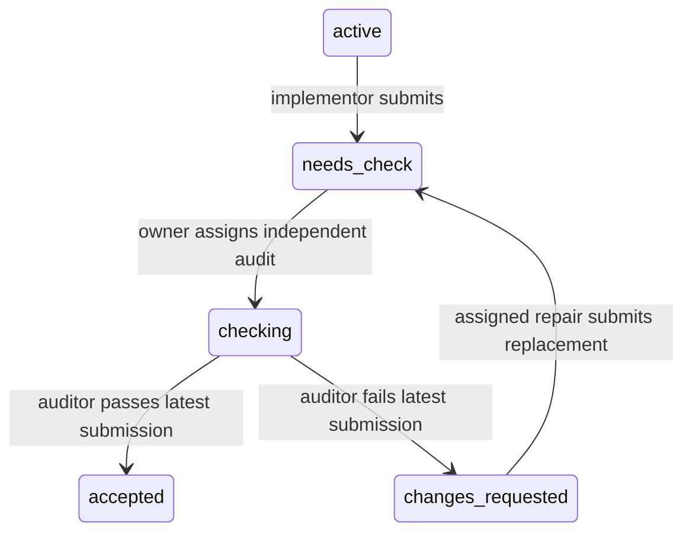

# Focused interaction evaluations

Status: independent-audit pilot and eight schema regression scenarios implemented
September 16, 2026; remaining stages are planned. See the
[usage guide](../../eval/interaction/README.md).

## Objective

Evaluate one precise interaction from a known state: delegation, submission,
audit, repair, reassignment, waiting, or recovery. Report model behavior and
harness correctness separately. Keep the coding ladder as the end-to-end check
that these capabilities compose into useful work.

The unit of evaluation is **initial state + stimulus + allowed transitions +
required outcome + forbidden effects**. A task can take only a few tool calls
and still expose a consequential coordination error.

## Starting point in Strap

- [`harness/agent_discovery_eval_test.go`](../../harness/agent_discovery_eval_test.go)
  already seeds a real session through public APIs and evaluates one live actor
  with idle collaborators. Its six cases cover creation, reuse, audit, repair,
  replacement, and worker help. It counts rejected calls separately, but usually
  returns on the first accepted target call. It needs stronger state assertions,
  explicit end boundaries, reusable results, and repeated trials.
- [`work/`](../../work/) and [`internal/workflow/`](../../internal/workflow/)
  already test substantial lifecycle and authority behavior. Reuse those
  contracts and fill gaps; do not rewrite every unit test as an eval.
- [`harness.Session`](../../harness/session.go) provides the production assembly
  and role-specific provider injection. Model tools and host operations share
  workflow operations. Use this seam instead of introducing another coordinator.
- [`harness/inspection`](../../harness/inspection/README.md) provides fixed-prefix
  live and archive inspection. Reuse the canonical trace and projections.
- [`eval/runner.go`](../../eval/runner.go) is specialized for coding workspaces and
  hidden Go tests. Add a sibling interaction suite; share useful recording and
  reporting helpers only where needed.

## Separate the questions

| Track | What executes | What it establishes |
| --- | --- | --- |
| Harness conformance | Public commands and scripted providers, no live model | Valid transitions succeed; invalid transitions are rejected without domain mutations; routing and projections agree |
| Model interaction | One live role, controlled collaborators and environment | The model discovers and chooses appropriate operations, supplies correct bindings, interprets evidence, and recovers appropriately |
| Short workflow | Several live roles in a tiny fixed problem | Individually correct interactions compose through submission, audit, and repair |
| Existing coding ladder | Full practical task | The complete system produces working software |

Conformance is a deterministic gate. Model interaction produces empirical rates.
A rejected illegal request can be a harness success and a model failure in the
same trial. A live run that never attempts an illegal transition provides no
coverage of the corresponding rejection guard.

The schema regression family now exercises wrong operation fields, missing
required bindings, removed selectors and tool names, null-valued extra fields,
pass/fail finding constraints, and misplaced progress objectives. Scripted cases
force the known malformed request followed by a corrected request; live cases
measure avoidance or recovery with one real actor in the root, auditor, or
implementor role. Each uses that role's production tool catalog and dispatcher.

The schema oracle uses an independent JSON Schema validator against the captured
catalog, then checks actual rejection, absence of domain mutations, and the
corrected operation's state transition. Reports separately score first-operation
tool choice and selected-tool argument validity. Read-only discovery is excluded
from that first operation; unattempted and unscorable trials are reported rather
than silently reducing the denominator. Eventual recovery does not erase the
first-call failure. Scripted providers bypass the server wire parser; live runs
use the configured model server. These cases complement structural schema/decoder
conformance tests without claiming exhaustive coverage.

## Define the contract before the scenarios

Create a compact contract table for each operation: actor/role, source state,
required IDs and revisions, destination state, emitted facts, visibility changes,
and invariants. Label each rule as an existing runtime guarantee, a model/prompt
obligation, or a proposed behavior change. Contradictions are explicit design
decisions, not silent edits to the expected result.

For an original implementation, the central lifecycle is:

This diagram omits cancellation and applies to the original implementation
record. Repair assignment leaves that original in `changes_requested` and creates
a separate active repair. Audit and repair records close independently. Agent
execution state, message delivery, plan-step status, and work state are separate
dimensions; an idle agent or a final text reply does not establish acceptance.

Priority invariants:

1. Agent creation starts no work; assignment selects an eligible existing actor.
2. Only authorized actors mutate work, with current revisions and assignment
   bindings. Rejection preserves domain state, reservations, and revision numbers;
   recording the rejected invocation itself is expected.
3. Concurrent implementation scopes cannot reserve the same plan step.
4. Submission makes work reviewable; only a passing independent audit accepts
   implementation and completes its scoped steps.
5. Audit assignment and verdict bind to the correct submission; implementation
   and repair contributors cannot audit their submission chain.
6. Repair binds to the current failed audit, preserves immutable prior records,
   and cannot be duplicated for that audit. Its submission supersedes the prior
   submission and requires another audit.
7. Reassignment invalidates the displaced actor's mutation authority. Cancellation
   follows the specified chain semantics and releases the corresponding scope.
8. Execution failure, blocker, or missing evidence does not fabricate an audit
   failure or an accepted outcome.
9. At the same accepted trace prefix, public inspection and archive reconstruction
   expose equivalent relevant state. Replay performs no execution.

Public inspection already derives work state from accepted records. Agreement
with archive replay checks consistency, not independent correctness; explicit
expected transitions and lower-level store tests remain the behavioral oracle.
Likewise, validation rejection and publication failure have different contracts:
publication failure can latch the store after an internal mutation, preventing
dispatch and further mutations. Do not assert rollback for that failure path.

Audit evidence needs its own distinction. Currently `submit_work` can carry free
text evidence, and `submit_audit` validates verdict structure without mechanically
proving that the auditor performed sufficient checks. Progress execution references
have stronger provenance checks. Historical evidence inherited on reassignment is
intentionally permitted; old evidence is not automatically invalid. Tests must
distinguish provenance, applicability to the current artifact, and sufficiency
for the claim. Stronger runtime evidence requirements would be a separate change.

## Scenario harness

Implement an internal Go scenario package at `eval/interaction`, initially using
typed fixtures and predicates. Avoid a custom scenario language until repetition
shows what needs to be data. Keep lower-level generated contract tests close to
their domain packages.

Each scenario defines:

- Stable ID, version, interaction family, contract IDs, and role under test.
- Fixture builder using public session operations, with symbolic handles for
  generated actor/work/submission/audit IDs. Never depend on literal ID numbers.
- Production role prompt and relevant production tool definitions; collaborators
  use scripted providers. Record any tool or prompt overrides as a different
  experiment. Disable unrelated local/web capabilities for coordination fixtures;
  enable fixture-local tools for evidence and artifact cases.
- A natural-language stimulus or a real routed notification. Explicit instructions
  test discoverability; less directive variants test autonomous policy selection.
  The model never sees hidden expected actions or the oracle.
- Named assertions over accepted state, tool attempts/results, routed messages,
  and fixture artifacts. Use semantic predicates and required causal ordering,
  allowing equivalent valid sequences and harmless inspection calls.
- A terminal condition, model-call/tool-call limits, recovery allowance, and
  wall-clock timeout. All limits are recorded and configurable per scenario.

Setup runs behind provider gates. Capture a trace cursor after setup so seeded
actions are never credited to the actor. Release only the actor being evaluated.
Script collaborators at explicit barriers to make delivery timing reproducible.
Provider injection is currently per role. Start with one evaluated actor of that
role; if several actors share it, route the provider by `provider.Request.Agent`
so only the intended actor calls the live model. Run live trials sequentially by
default; record concurrency when explicitly enabled.

Fixture setup may call typed host APIs, but scripted actor responses must traverse
production tool schemas, decoding, dispatch, and workflow. Retain direct API/tool
parity checks for selected operations. Invalid JSON and illegal operation fields
must exercise the real boundary instead of injecting a fabricated error receipt.

Do not return immediately on the first desired tool call. Observe the rest of
the current tool batch and the scenario's defined handoff, reply, or yield. Gate
further provider execution at a known boundary, pin the grading prefix, then
clean up. Grade all forbidden effects in that interval. Keep cleanup-generated
cancellations outside the behavioral score while verifying cleanup separately.
Use synchronization and event conditions instead of sleeps as correctness tests.

Assertion output identifies the first divergence: assertion ID, expected versus
observed values, actor/work bindings, and trace cursor/invocation. Incomplete
capture or failed projection cannot silently count as a behavioral pass.

## Initial scenario backlog

| Family | Controlled situation | Required observation |
| --- | --- | --- |
| Delegate new work | No eligible worker exists | Plan/scope as required, explicit implementor creation, one correctly bound assignment; no premature completion |
| Reuse | Eligible idle implementor is available and reuse is requested | Existing actor receives new work; no unnecessary replacement |
| Independent audit | Implementation is `needs_check` | Eligible auditor receives an audit of the latest submission; original becomes `checking`; steps remain incomplete |
| Submit implementation | Scoped implementation is ready | Progress and submission use current work revision; original becomes `needs_check`; no acceptance by text |
| Audit pass/fail pair | Tiny known-good artifact versus a seeded defect | Auditor reaches the correct verdict with relevant verification; failing findings identify required change and affected scope |
| Evidence gap | Evidence cannot establish a required claim | Auditor reports the verification gap/blocker and seeks evidence; no unsupported pass or invented defect |
| Repair | Failed audit exists | One repair binds to the latest audit and affected scope; correction creates a superseding submission; independent re-audit is required |
| Replacement | Assigned worker stopped | Transfer existing work to an eligible replacement; old actor loses authority; do not create unrelated replacement work |
| Worker help | Implementor needs owner assistance | Correctly routed help request plus recorded blocker; no fabricated submission |
| Waiting | Active delegated work versus no active work | Wait/yield only in the valid case; no busy polling or unsupported success claim |
| Conflict recovery | A revision advances after the actor reads it | Stale mutation is rejected without effects; actor refreshes and issues a correctly bound action within budget |
| Authority and binding | Wrong actor, submission, audit, or scope | Deterministic rejection with no domain effects; live variants assess avoidance or correction separately |
| Cancellation and races | Cancel/submit or duplicate repair compete | One permitted history, no duplicate commitment, no leaked reservations or stale authority |
| Provider/output fault | Truncated arguments, canceled stream, or execution failure | Defined runtime outcome, valid subsequent inspection/replay, bounded continuation according to the current contract |

Pair near-identical situations where only one fact changes: latest versus old
submission, independent auditor versus contributor, ready versus blocked work,
valid versus stale revision, complete versus insufficient evidence. This tests
whether the decision follows the controlling fact. Vary phrasing and irrelevant
IDs/order independently from the correct answer.

For audit judgment, use small fixtures with known truth, including both passing
and failing examples. Deterministic checks grade verdicts, required evidence
references/actions, scope, and artifact changes. Free-text explanation quality
can receive a secondary human rubric; do not rely on an LLM judge to establish
state correctness or allow unsupported claims to pass through keyword matching.
Read-only auditing is a behavioral obligation too: omitting write-file tools does
not prevent shell writes. Check fixture changes where that behavior is in scope.

## Scores and artifacts

Keep the scorecard separate rather than collapsing it to one number:

| Area | Report |
| --- | --- |
| Harness correctness | Required conformance cases passed/total, exercised transition/guard coverage, invariant violations, replay mismatches |
| Model correctness | Correct outcome per scenario/family/role; clean success without invalid or forbidden actions; bounded recovery success |
| Model mistakes | Invalid calls, wrong bindings/roles, forbidden attempts, unsupported acceptance, unnecessary mutation or repeated waiting |
| Efficiency | Calls and tokens to the correct outcome, latency, extra agents/assignments; unavailable usage stays unavailable |
| Run validity | Provider/environment errors, capture/projection failures, harness errors, and actor budget exhaustion reported distinctly |

“Clean success” permits reads and legitimate alternative action sequences; it
does not mean the first tool must mutate state. Recovery never erases an earlier
mistake or an invariant violation. If state integrity is lost, preserve earlier
behavior observations and mark dependent model judgments unscorable.

Report behavioral denominators alongside error counts. Provider outages do not
become model failures; exhausting the declared action budget during a healthy
trial is a failure to finish that scenario. Expected injected faults are part of
the scenario and are scored against its defined recovery contract.
Classify errors from their originating boundary and available typed evidence.
An arbitrary tool error is not necessarily an invalid model call; retain an
unknown category where the runtime cannot distinguish the cause reliably.

Each trial saves `trace.jsonl`, scenario/version and fixture manifest, grading
cursors, assertion results, effective model and generation settings, role prompt
and tool-schema hashes, harness build identity, and usage. Fingerprint dirty
source/configuration as well as the commit; `-dirty` alone cannot reproduce a
run. Resume only trials whose experiment fingerprint matches. Preserve failures
and produce per-scenario comparisons between runs.

Repeat live trials. Start with five per scenario for smoke diagnostics and twenty
for initial comparisons, then adjust based on variance and cost. Show counts and
confidence intervals; twenty trials are not a certification of near-perfect
reliability. Compare the same fixture variants and settings, interleave runs when
possible, and retain paraphrase/fixture variants held out from prompt tuning.
Provider seeds, when supported, do not promise deterministic live execution.

## Implementation sequence

1. **Contract map and pilot.** Inventory existing tests against the contract table.
   Build one vertical slice for `needs_check -> checking` with public-API setup,
   role providers, bounded observation, state/trace assertions, and saved results.
   Add variants for contributor rejection, old submission, and stale revision.
   Exit: a scripted good path passes, deliberately wrong paths fail at the right
   assertion, and live execution produces the same score structure.
2. **Delegation and audit suite.** Port and strengthen the six discovery cases;
   add submission, audit pass/fail, evidence gap, and waiting. Include one fully
   scripted submit -> failed audit -> repair -> resubmit -> passing audit cycle
   as a conformance baseline. Introduce a
   dedicated `strap-eval interaction` command group for listing, running, and
   reporting scenarios (implemented); package tests provide deterministic
   self-checks. Exit: all cases run without live models in conformance
   mode; individual real roles can be selected and repeated with complete traces.
3. **Repair and resilience.** Extend the failed-audit case through repair and
   re-audit with live roles. Add controlled stale reads, cancellation, duplicate
   commands, same-revision races, publication failure, and output failure cases
   drawn from real traces. Compare
   relevant public live state and archive reconstruction at matching boundaries.
   Exit: failures are localized and retained as minimal reproducible scenarios.
4. **Generated sequences and short workflows.** Add a small independent reference
   model for selected lifecycle rules and generate bounded legal/illegal action
   sequences. Use Go fuzzing to preserve and minimize failures, plus explicit
   scheduling barriers for concurrency cases. Check invariants after each
   operation. Add a handful of multi-role live workflows, then run a ladder smoke
   check after interaction improvements. Exit: targeted gains persist on held-out
   variants and compose without practical regressions.

Self-check the grader itself using valid and deliberately faulty scripted
providers: wrong submission, extra mutation later in a batch, omitted blocker,
duplicate assignment, forged execution reference, and premature acceptance.
Each faulty script must fail its intended assertion. Test incomplete capture
classification as well. Existing deterministic package tests remain CI gates;
the new suite adds shared scenarios, diagnosis, and model comparison.

Use deterministic conformance checks on every relevant change. Keep live runs
opt-in initially, then establish a baseline before setting regression thresholds.
The refinement loop is: isolate a failure, add the smallest discriminating case,
change one prompt/tool/error/runtime behavior, rerun that family and its held-out
variants, then check short workflows and the ladder. Measure prompt, model,
sampling, and harness changes separately.

## Scope and method

The first release needs Go fixtures, scripted providers, semantic assertions,
trace-backed reports, and one live-role mode. It does not need a visual editor,
external eval platform, a general scenario DSL, formal verification, or a new
runtime state machine. Claims remain bounded by the cases and action schedules
actually exercised.

The later generated-sequence approach follows established [stateful/model-based
testing](https://hypothesis.readthedocs.io/en/latest/stateful.html): compare action
sequences with a small independent behavioral model and check invariants between
steps. [Go's built-in fuzzing](https://go.dev/doc/security/fuzz/) supplies corpus
retention and input minimization without introducing a Python dependency.
